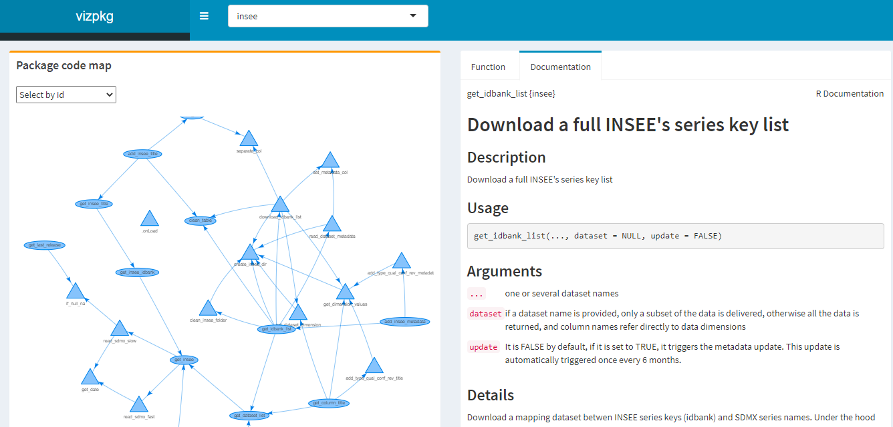

vizpkg R package
================

## Overview

*Experimental*

This package contains an R-Shiny Dashboard used to analyse any R package.
The user can draw an interactive network plot displaying the connections between the R package's functions.

This package is a tool to help R users and developers understand how R packages work.

## Installation, Loading an Use

``` r
# Get the development version from GitHub
# install.packages("devtools")
# devtools::install_github("hadrilec/vizpkg")

library(vizpkg)

# Use
vizpkgApp()

```

## Dashboard




## Contributing

## Support

Feel free to contact me with any question about this package using this [e-mail address](mailto:hadrien.leclerc@insee.fr?subject=%5Br-package%5D%5Binsee%5D).
